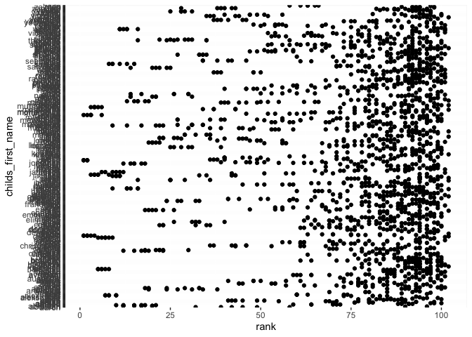

p8105\_hw2\_ra2965
================

Problem 1
=========

Read and clean the Mr. Trash Wheel sheet:
-----------------------------------------

``` r
library(tidyverse)
```

    ## ── Attaching packages ──────────────────────────────────────────────── tidyverse 1.2.1 ──

    ## ✔ ggplot2 3.2.1     ✔ purrr   0.3.2
    ## ✔ tibble  2.1.3     ✔ dplyr   0.8.3
    ## ✔ tidyr   1.0.0     ✔ stringr 1.4.0
    ## ✔ readr   1.3.1     ✔ forcats 0.4.0

    ## ── Conflicts ─────────────────────────────────────────────────── tidyverse_conflicts() ──
    ## ✖ dplyr::filter() masks stats::filter()
    ## ✖ dplyr::lag()    masks stats::lag()

``` r
trash_wheel = readxl::read_excel("/Users/anran/Desktop/DataScience/week4/hw2/data/Trash-Wheel-Collection-Totals-8-6-19.xlsx", sheet = "Mr. Trash Wheel") %>%
  janitor::clean_names() %>%
    select(-x15, -x16,-x17) %>%
    drop_na(dumpster) %>%
    mutate(sports_balls = as.integer(sports_balls))
```

    ## New names:
    ## * `` -> ...15
    ## * `` -> ...16
    ## * `` -> ...17

Read and clean precipitation data for 2017 and 2018, and then combine them:
---------------------------------------------------------------------------

``` r
precipitation_2018 = readxl::read_excel("/Users/anran/Desktop/DataScience/week4/hw2/data/Trash-Wheel-Collection-Totals-8-6-19.xlsx",sheet = "2018 Precipitation", skip = 1) %>%
janitor::clean_names() %>%
drop_na(.) %>%
mutate(year = 2018)


precipitation_2017 = readxl::read_excel("/Users/anran/Desktop/DataScience/week4/hw2/data/Trash-Wheel-Collection-Totals-8-6-19.xlsx",sheet = "2017 Precipitation",skip = 1) %>%
janitor::clean_names() %>%
drop_na(.) %>%
mutate(year = 2017)

precipitation = full_join(precipitation_2017, precipitation_2018) %>%
mutate(month = month.name[month])
```

    ## Joining, by = c("month", "total", "year")

There are 344 observations and 14 variables in the Mr. Trash Wheel dataset. The dataset includes key variables of dumpster, month, year, date, weight\_tons, volume\_cubic\_yards, plastic\_bottles, polystyrene, cigarette\_butts, glass\_bottles, grocery\_bags, chip\_bags, sports\_balls, homes\_powered, which are the dumpter number, date of collection, litter type and amount of litter for each type.

There are 24 observations and 3 in the precipitation dataset. The dataset includes key variables of month, total, year, which are the precipitation data for each month in 2017 and 2018.

For available data, the total precipitation in 2018 is 70.33. The median number of sports balls in a dumpster in 2017 is 8.

Problem 2
=========

``` r
pols = read_csv(file = "../data/fivethirtyeight_datasets/pols-month.csv") %>%
janitor::clean_names() %>%
separate(mon, into = c("year","month","day"), sep = "-", convert = TRUE) %>%
mutate(month = month.abb[month]) %>%
  mutate(president = ifelse(prez_gop > 0, "gop","dem")) %>%
  select(-prez_gop, -prez_dem, -day)
```

    ## Parsed with column specification:
    ## cols(
    ##   mon = col_date(format = ""),
    ##   prez_gop = col_double(),
    ##   gov_gop = col_double(),
    ##   sen_gop = col_double(),
    ##   rep_gop = col_double(),
    ##   prez_dem = col_double(),
    ##   gov_dem = col_double(),
    ##   sen_dem = col_double(),
    ##   rep_dem = col_double()
    ## )

``` r
snp = read_csv(file = "../data/fivethirtyeight_datasets/snp.csv") %>%
separate("date", into = c("day","month","year"), sep = "/", convert = TRUE) %>%
  arrange(year, month)%>%
  mutate(month = month.abb[month])%>%
  select(year, month, everything(),-day)
```

    ## Parsed with column specification:
    ## cols(
    ##   date = col_character(),
    ##   close = col_double()
    ## )

``` r
unemployment = read_csv(file = "../data/fivethirtyeight_datasets/unemployment.csv") %>%
  pivot_longer(Jan:Dec,
             names_to = "month",
             values_to = "percent_unemployment"
) %>%
  select(year = Year, everything())
```

    ## Parsed with column specification:
    ## cols(
    ##   Year = col_double(),
    ##   Jan = col_double(),
    ##   Feb = col_double(),
    ##   Mar = col_double(),
    ##   Apr = col_double(),
    ##   May = col_double(),
    ##   Jun = col_double(),
    ##   Jul = col_double(),
    ##   Aug = col_double(),
    ##   Sep = col_double(),
    ##   Oct = col_double(),
    ##   Nov = col_double(),
    ##   Dec = col_double()
    ## )

Join the datasets：

``` r
snp_pols = left_join(pols, snp, by = c("month","year"))
snp_pols_emp = left_join(snp_pols, unemployment, by = c("month","year"))
```

Write a short paragraph about these datasets. Explain briefly what each dataset contained, and describe the resulting dataset (e.g. give the dimension, range of years, and names of key variables).

The cleaned file “pols-month” contains 822 observations of 9 variables related to the number of national politicians who are democratic or republican at any given time. The key variables in this dataset are year, month, gov\_gop, sen\_gop, rep\_gop, gov\_dem, sen\_dem, rep\_dem, president.

1391, 11

1947 to 2015

Note: we could have used a date variable as a key instead of creating year and month keys; doing so would help with some kinds of plotting, and be a more accurate representation of the data. Date formats are tricky, though. For more information check out the lubridate package in the tidyverse.

``` r
baby_names = read_csv(file = "../data/Popular_Baby_Names.csv") %>%
  janitor::clean_names() %>%
  mutate(ethnicity = recode(ethnicity, "ASIAN AND PACI" = "ASIAN AND PACIFIC ISLANDER", "BLACK NON HISP"= "BLACK NON HISPANIC","WHITE NON HISP" = "WHITE NON HISPANIC"))%>%
  mutate(childs_first_name = str_to_lower(childs_first_name)) %>%
  distinct()
```

    ## Parsed with column specification:
    ## cols(
    ##   `Year of Birth` = col_double(),
    ##   Gender = col_character(),
    ##   Ethnicity = col_character(),
    ##   `Child's First Name` = col_character(),
    ##   Count = col_double(),
    ##   Rank = col_double()
    ## )

``` r
baby_names %>% filter(childs_first_name == "olivia",gender == "FEMALE") %>% select(childs_first_name, year_of_birth,ethnicity, rank) %>%
  pivot_wider(names_from = "year_of_birth",
              values_from = "rank") %>% knitr::kable()
```

| childs\_first\_name | ethnicity                  |  2016|  2015|  2014|  2013|  2012|  2011|
|:--------------------|:---------------------------|-----:|-----:|-----:|-----:|-----:|-----:|
| olivia              | ASIAN AND PACIFIC ISLANDER |     1|     1|     1|     3|     3|     4|
| olivia              | BLACK NON HISPANIC         |     8|     4|     8|     6|     8|    10|
| olivia              | HISPANIC                   |    13|    16|    16|    22|    22|    18|
| olivia              | WHITE NON HISPANIC         |     1|     1|     1|     1|     4|     2|

``` r
baby_names %>% filter(gender == "MALE",rank == 1) %>% select(childs_first_name, year_of_birth,ethnicity) %>% pivot_wider(names_from = "year_of_birth",
              values_from = "childs_first_name") %>% knitr::kable()
```

| ethnicity                  | 2016   | 2015   | 2014   | 2013   | 2012   | 2011    |
|:---------------------------|:-------|:-------|:-------|:-------|:-------|:--------|
| ASIAN AND PACIFIC ISLANDER | ethan  | jayden | jayden | jayden | ryan   | ethan   |
| BLACK NON HISPANIC         | noah   | noah   | ethan  | ethan  | jayden | jayden  |
| HISPANIC                   | liam   | liam   | liam   | jayden | jayden | jayden  |
| WHITE NON HISPANIC         | joseph | david  | joseph | david  | joseph | michael |

``` r
library(ggridges)
```

    ## 
    ## Attaching package: 'ggridges'

    ## The following object is masked from 'package:ggplot2':
    ## 
    ##     scale_discrete_manual

``` r
plot_df = filter(baby_names, ethnicity == "WHITE NON HISPANIC", gender == "MALE", year_of_birth == 2016)
ggplot(plot_df, aes(x = rank, y = count)) + geom_point() +
  labs(
    title = "The first name of male, white non-hispanic children born in 2016",
    x = "The rank in popularity of that name (rank)",
    y = "The number of children with a name (count)")
```


