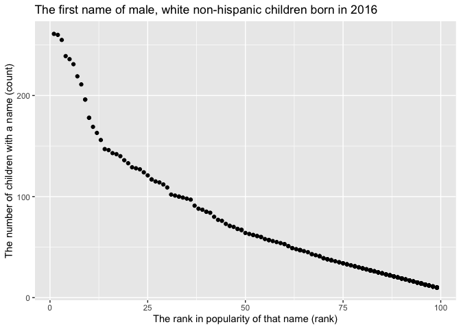

p8105\_hw2\_ra2965
================

Problem 1
=========

Read and clean the Mr. Trash Wheel sheet:
-----------------------------------------

``` r
library(tidyverse)

trash_wheel = readxl::read_excel("./data/Trash-Wheel-Collection-Totals-8-6-19.xlsx", sheet = "Mr. Trash Wheel") %>%
  janitor::clean_names() %>%
    select(-x15, -x16,-x17) %>%
    drop_na(dumpster) %>%
    mutate(sports_balls = round(sports_balls)) %>%
  mutate(sports_balls = as.integer(sports_balls))
```

Read and clean precipitation data for 2017 and 2018, and then combine them:
---------------------------------------------------------------------------

``` r
precipitation_2018 = readxl::read_excel("./data/Trash-Wheel-Collection-Totals-8-6-19.xlsx",sheet = "2018 Precipitation", skip = 1) %>%
janitor::clean_names() %>%
drop_na(.) %>%
mutate(year = 2018)


precipitation_2017 = readxl::read_excel("./data/Trash-Wheel-Collection-Totals-8-6-19.xlsx",sheet = "2017 Precipitation",skip = 1) %>%
janitor::clean_names() %>%
drop_na(.) %>%
mutate(year = 2017)

precipitation = full_join(precipitation_2017, precipitation_2018) %>%
mutate(month = month.name[month])
```

There are 344 observations and 14 variables in the Mr. Trash Wheel dataset. The dataset includes key variables of dumpster, month, year, date, weight\_tons, volume\_cubic\_yards, plastic\_bottles, polystyrene, cigarette\_butts, glass\_bottles, grocery\_bags, chip\_bags, sports\_balls, homes\_powered, which are the dumpter number, date of collection, litter type and amount of litter for each type.

There are 24 observations and 3 variables in the precipitation dataset. The dataset includes key variables of month, total, year, which are the precipitation data for each month in 2017 and 2018.

For available data, the total precipitation in 2018 is 70.33. The median number of sports balls in a dumpster in 2017 is 8.

Problem 2
=========

Read and clean the data file pols-month:
----------------------------------------

``` r
pols = read_csv(file = "./data/fivethirtyeight_datasets/pols-month.csv") %>%
janitor::clean_names() %>%
separate(mon, into = c("year","month","day"), sep = "-", convert = TRUE) %>%
mutate(month = month.abb[month]) %>%
  mutate(president = ifelse(prez_gop > 0, "gop","dem")) %>%
  select(-prez_gop, -prez_dem, -day)
```

Read and clean the data file snp:
---------------------------------

``` r
snp = read_csv(file = "./data/fivethirtyeight_datasets/snp.csv") %>%
separate("date", into = c("day","month","year"), sep = "/", convert = TRUE) %>%
  arrange(year, month)%>%
  mutate(month = month.abb[month])%>%
  select(year, month, everything(),-day)
```

Read and clean the data file unemployment:
------------------------------------------

``` r
unemployment = read_csv(file = "./data/fivethirtyeight_datasets/unemployment.csv") %>% pivot_longer(
             Jan:Dec,
             names_to = "month",
             values_to = "percent_unemployment"
) %>% select(year = Year, everything())
```

Join the datasets：
-------------------

``` r
snp_pols = left_join(pols, snp, by = c("month","year"))
snp_pols_emp = left_join(snp_pols, unemployment, by = c("month","year"))
```

The cleaned file “pols-month” contains 822 observations of 9 variables. The variables are related to the number of national politicians who are democratic or republican at any given time during 1947 to 2015.

Key variables:

president: an indicator of whether the president was republican on the associated date.

gov\_gop, sen\_gop, rep\_gop: the number of republican governors, senators and representatives on the associated date.

gov\_dem,sen\_dem, rep\_dem: the number of democratic governors, senators and representatives on the associated date.

The cleaned file “snp” contains 787 observations of 3 variables. The year range in this dataset is from 1950 to 2015.

Key variable:

close: the closing values of the S&P stock index on the associated date, which is often used as a representative measure of stock market as a whole.

The file “unemployment” contains 816 observations of 3 variables. The year range in this dataset is from 1948 to 2015.

Key variable:

percent\_unemployment: the percentage of unemployment of the associated month and year.

The joined file snp\_pols\_emp which chombines the three datadets contains 1391 observations of 11 variables. The year range in this dataset is from 1947 to 2015.

Key variables:

gov\_gop, sen\_gop, rep\_gop: the number of republican governors, senators and representatives on the associated date.

gov\_dem,sen\_dem, rep\_dem: the numbers for democratic overnors, senators and representatives on the associated date.

president: an indicator of whether the president was republican on the associated date.

close: the closing values of the S&P stock index on the associated date.

percent\_unemployment: the percentage of unemployment of the associated date.

Problem 3
=========

Import and clean the datafile of popular baby names:
----------------------------------------------------

``` r
baby_names = read_csv(file = "./data/Popular_Baby_Names.csv") %>%
  janitor::clean_names() %>%
  mutate(ethnicity = recode(ethnicity, "ASIAN AND PACI" = "ASIAN AND PACIFIC ISLANDER", "BLACK NON HISP"= "BLACK NON HISPANIC","WHITE NON HISP" = "WHITE NON HISPANIC"))%>%
  mutate(childs_first_name = str_to_lower(childs_first_name)) %>%
  distinct()
```

Produce two reader-friendly tables:
-----------------------------------

``` r
baby_names %>% filter(childs_first_name == "olivia",gender == "FEMALE") %>% select(childs_first_name, year_of_birth,ethnicity, rank) %>%
  pivot_wider(names_from = "year_of_birth",
              values_from = "rank") %>% knitr::kable()
```

| childs\_first\_name | ethnicity                  |  2016|  2015|  2014|  2013|  2012|  2011|
|:--------------------|:---------------------------|-----:|-----:|-----:|-----:|-----:|-----:|
| olivia              | ASIAN AND PACIFIC ISLANDER |     1|     1|     1|     3|     3|     4|
| olivia              | BLACK NON HISPANIC         |     8|     4|     8|     6|     8|    10|
| olivia              | HISPANIC                   |    13|    16|    16|    22|    22|    18|
| olivia              | WHITE NON HISPANIC         |     1|     1|     1|     1|     4|     2|

``` r
baby_names %>% filter(gender == "MALE",rank == 1) %>% select(childs_first_name, year_of_birth,ethnicity) %>% pivot_wider(names_from = "year_of_birth",
              values_from = "childs_first_name") %>% knitr::kable()
```

| ethnicity                  | 2016   | 2015   | 2014   | 2013   | 2012   | 2011    |
|:---------------------------|:-------|:-------|:-------|:-------|:-------|:--------|
| ASIAN AND PACIFIC ISLANDER | ethan  | jayden | jayden | jayden | ryan   | ethan   |
| BLACK NON HISPANIC         | noah   | noah   | ethan  | ethan  | jayden | jayden  |
| HISPANIC                   | liam   | liam   | liam   | jayden | jayden | jayden  |
| WHITE NON HISPANIC         | joseph | david  | joseph | david  | joseph | michael |

Produce a scatter plot:
-----------------------

``` r
library(ggridges)
plot_df = filter(baby_names, ethnicity == "WHITE NON HISPANIC", gender == "MALE", year_of_birth == 2016)
ggplot(plot_df, aes(x = rank, y = count)) + geom_point() +
  labs(
    title = "The first name of male, white non-hispanic children born in 2016",
    x = "The rank in popularity of that name (rank)",
    y = "The number of children with a name (count)")
```


